# 📋 Demo Document — Universal Data Connector

---

## 1. Data Flow Diagram

### 1.1 REST API Data Flow


**Step-by-step REST flow:**

1. **Client sends HTTP request** → e.g. `GET /data/support?priority=high&status=open`
2. **Router** (`data.py`) selects the correct connector and passes filter parameters
3. **Connector** loads JSON from disk, applies filters (status, priority, date range), sorts, paginates, and returns `{items, total}`
4. **Business Rules Engine** applies priority sorting (`high > medium > low`) and generates a context string like *"Showing 5 of 12 Support Tickets records (filtered by priority=high, status=open)"*
5. **Voice Optimizer** generates a natural-language summary: *"I found 12 support tickets. 8 are currently open. 5 are high priority."*
6. **Data Type Identifier** classifies the response shape (tabular, time-series, etc.)
7. **Router** wraps everything in a `DataResponse` envelope with full metadata and returns JSON

---

### 1.2 Voice Agent Data Flow

```mermaid
sequenceDiagram
    participant User as 🎤 User (Microphone)
    participant RTC as FastRTC Stream<br/>(fastrtc_data_stream.py)
    participant STT as Groq Whisper<br/>(STT)
    participant Agent as LangGraph Agent<br/>(data_connector_agent.py)
    participant Tools as Data Tools<br/>(7 functions)
    participant Data as JSON Files<br/>(data/)
    participant TTS as Groq Orpheus<br/>(TTS)
    participant Speaker as 🔊 Speaker

    User->>RTC: Speak into microphone
    RTC->>RTC: Detect pause in speech<br/>(ReplyOnPause handler)
    RTC->>STT: Send audio bytes
    STT-->>RTC: Return transcript text

    RTC->>Agent: Send user message
    Agent->>Agent: Decide which tool(s) to call
    Agent->>Tools: Invoke e.g. get_support_tickets(priority="high")
    Tools->>Data: Load & filter JSON
    Data-->>Tools: Return filtered records
    Tools-->>Agent: Return JSON string result
    Agent->>Agent: Summarize data for voice

    Agent-->>RTC: Return response text
    RTC->>TTS: Send text to speech API
    TTS-->>RTC: Return WAV audio
    RTC->>RTC: Convert WAV → numpy array<br/>(process_groq_tts.py)
    RTC-->>Speaker: Stream audio to user
```



**Step-by-step Voice flow:**

1. **User speaks** into their microphone via the Gradio UI (or phone)
2. **FastRTC** detects a pause in speech using its `ReplyOnPause` handler
3. Audio is sent to **Groq Whisper** (STT) which returns the transcript
4. The transcript is passed to the **LangGraph ReAct Agent** as a user message
5. The agent **autonomously decides** which data tools to invoke based on the query
6. Tools **load JSON, filter, and return** structured data
7. The agent **formulates a concise spoken response** (e.g., *"You have about 12 open tickets, 5 are high priority"*)
8. Response text is sent to **Groq Orpheus TTS** which produces WAV audio
9. `process_groq_tts.py` converts the WAV to a numpy array
10. **FastRTC streams** the audio back to the user's speaker

---

## 2. Code Demonstration & Functionality

### 2.1 Data Connector Pattern (Abstraction)

The project uses an **abstract base class** to enforce a consistent interface across all data sources:

```python
# app/connectors/base.py
class BaseConnector(ABC):
    @property
    @abstractmethod
    def source_name(self) -> str: ...

    @abstractmethod
    def fetch(self, *, limit=10, page=1, sort_by=None, sort_order="desc", **filters): ...

    @abstractmethod
    def search(self, query: str, *, limit=10): ...

    @abstractmethod
    def get_by_id(self, record_id: int): ...

    @abstractmethod
    def get_tool_definitions(self) -> List[Dict]: ...
```

Every connector (`CRMConnector`, `SupportConnector`, `AnalyticsConnector`) implements this interface, making it trivial to add new data sources.

---

### 2.2 CRM Connector — Filter & Search

```python
# app/connectors/crm_connector.py

class CRMConnector(BaseConnector):
    source_name = "CRM"
    data_type = DataType.TABULAR

    def fetch(self, *, limit=10, page=1, sort_by="created_at", sort_order="desc", **filters):
        data = self._load()

        # Filter by status (active/inactive)
        status = filters.get("status")
        if status:
            data = [r for r in data if r["status"] == status]

        # Sort
        if sort_by and data and sort_by in data[0]:
            data.sort(key=lambda r: r.get(sort_by, ""), reverse=(sort_order == "desc"))

        # Paginate
        total = len(data)
        start = (page - 1) * limit
        items = data[start : start + limit]
        return {"items": items, "total": total}

    def search(self, query, *, limit=10):
        q = query.lower()
        data = self._load()
        hits = [r for r in data if q in r["name"].lower() or q in r["email"].lower()]
        return {"items": hits[:limit], "total": len(hits)}
```

**Example output** for `GET /data/crm?status=active&limit=3`:

```json
{
  "data": [
    { "customer_id": 5,  "name": "Customer 5",  "email": "user5@example.com",  "status": "active", "created_at": "2026-01-13T03:46:48" },
    { "customer_id": 40, "name": "Customer 40", "email": "user40@example.com", "status": "active", "created_at": "2026-01-06T03:46:48" },
    { "customer_id": 50, "name": "Customer 50", "email": "user50@example.com", "status": "active", "created_at": "2026-01-11T03:46:48" }
  ],
  "metadata": {
    "total_results": 24,
    "returned_results": 3,
    "page": 1,
    "total_pages": 8,
    "data_type": "tabular",
    "data_freshness": "Data as of 2026-02-22 15:45 UTC",
    "voice_hint": "There are 21 more results. Ask me to show more if you'd like.",
    "query_context": "Showing 3 of 24 CRM records (filtered by status=active)"
  },
  "voice_summary": "I found 24 customers in the CRM. 3 are active. Showing the first 3."
}
```

---

### 2.3 Voice Optimizer — Natural Language Summaries

```python
# app/services/voice_optimizer.py

def generate_voice_summary(source, data, total):
    if source == "Support Tickets":
        open_count = sum(1 for r in data if r.get("status") == "open")
        high_count = sum(1 for r in data if r.get("priority") == "high")
        parts = [f"I found {total} support tickets"]
        if open_count:
            parts.append(f"{open_count} are currently open")
        if high_count:
            parts.append(f"{high_count} are high priority")
        return ". ".join(parts) + "."
```

Instead of dumping 50 ticket objects over voice, the user hears:
> *"I found 50 support tickets. 24 are currently open. 16 are high priority."*

---

### 2.4 LangGraph Agent — Autonomous Tool Calling

```python
# src/data_connector_agent.py

@tool
def get_support_tickets(priority="", status="", customer_id="", limit="5"):
    """Retrieve support tickets. Can filter by priority (high/medium/low),
    status (open/closed), and customer_id."""
    data = _load_tickets()
    if priority:
        data = [r for r in data if r["priority"] == priority]
    if status:
        data = [r for r in data if r["status"] == status]
    # Sort by priority: high > medium > low
    priority_order = {"high": 0, "medium": 1, "low": 2}
    data.sort(key=lambda r: priority_order.get(r.get("priority", ""), 99))
    ...
    return json.dumps({"items": items, "total": total, ...})

# Agent creation
agent = create_react_agent(
    model=ChatGroq(model="meta-llama/llama-4-scout-17b-16e-instruct"),
    tools=[search_customers, get_customers, get_customer_by_id,
           get_support_tickets, get_ticket_by_id,
           get_analytics, get_analytics_summary],
    checkpointer=InMemorySaver(),
    prompt="You are a friendly, concise AI assistant for a SaaS company..."
)
```

**Example voice conversation:**

| User says                            | Agent action                                            | Agent responds                                                                                  |
|--------------------------------------|--------------------------------------------------------|-------------------------------------------------------------------------------------------------|
| *"How many open tickets do we have?"* | Calls `get_support_tickets(status="open")`             | *"You've got about 24 open support tickets. 8 of those are high priority."*                    |
| *"Tell me about Customer 5"*         | Calls `search_customers(query="Customer 5")`           | *"Customer 5 signed up in January 2026, they're an active customer."*                          |
| *"What's the DAU trend?"*            | Calls `get_analytics_summary(metric="daily_active_users")` | *"Over the last 7 days, the average daily active users was around 540. The trend is up."*  |

---

### 2.5 Unified Response Envelope

Every REST endpoint wraps its response in a `DataResponse` model:

```python
# app/models/common.py

class DataResponse(BaseModel):
    data: List[Any]                # The actual records
    metadata: Metadata             # Pagination, freshness, data type, hints
    voice_summary: Optional[str]   # Ready-to-speak natural-language summary
```

This ensures **consistency** across all three data sources and makes it easy for any consuming application (chatbot, dashboard, mobile app) to process responses uniformly.

---

## 3. Scalability Discussion

### 3.1 Current Design — What Works at Small Scale

The current implementation reads data from **JSON files loaded from disk on every request**. With 50 customers, 50 tickets, and 30 analytics data points, this is perfectly performant — the full dataset fits in memory and filters execute in microseconds.

### 3.2 Can It Support 10,000 Users?

**Short answer: No, not without changes.** Here's a breakdown of the bottlenecks and required solutions:

---

### 3.3 Bottleneck Analysis

| Bottleneck                              | Current State                                          | Impact at 10K Users                                                                    |
|-----------------------------------------|--------------------------------------------------------|----------------------------------------------------------------------------------------|
| **Data Storage (JSON files)**           | Full JSON re-read + parse on every request             | 10K records × multiple requests/sec → excessive disk I/O and memory allocation        |
| **In-Memory Filtering**                 | Linear scan through all records for every filter       | O(n) per query × high concurrency → CPU bottleneck                                    |
| **No Caching**                          | Every request reloads data from disk                   | Redundant I/O; same data served thousands of times per second                          |
| **Single-Process Architecture**         | Uvicorn with a single worker                           | Cannot exploit multiple CPU cores; request queue grows under load                      |
| **LLM API Calls (Groq)**               | Synchronous, one at a time per voice session           | Groq rate limits; each voice turn = STT + LLM + TTS = 3 API calls                     |
| **InMemorySaver (LangGraph memory)**    | Stores all conversation history in process memory      | Memory grows unbounded; lost on restart; no multi-instance support                     |
| **No Authentication**                   | CORS allows all origins; no user isolation              | Any client can access all data; no per-user query scoping                              |

---

### 3.4 Required Changes for 10,000-User Scale

#### Layer 1: Database (Critical)

```diff
- JSON files loaded on every request
+ PostgreSQL / MongoDB with indexed columns
```

- Replace JSON file connectors with database-backed connectors
- Add indexes on `status`, `priority`, `customer_id`, `date`, `metric`
- Use SQL `LIMIT`/`OFFSET` instead of in-memory pagination
- Connection pooling with `asyncpg` or `motor`

**Example change in `CRMConnector`:**
```python
# BEFORE (current)
def fetch(self, *, limit=10, page=1, **filters):
    data = json.load(open("data/customers.json"))  # Full file read every time
    if filters.get("status"):
        data = [r for r in data if r["status"] == filters["status"]]
    # ... manual pagination

# AFTER (scaled)
async def fetch(self, *, limit=10, page=1, **filters):
    query = "SELECT * FROM customers WHERE 1=1"
    if filters.get("status"):
        query += " AND status = $1"
    query += f" ORDER BY created_at DESC LIMIT {limit} OFFSET {(page-1)*limit}"
    return await db.fetch(query, filters.get("status"))
```

#### Layer 2: Caching (High Impact)

```diff
- No caching
+ Redis cache with TTL-based invalidation
```

- Cache frequently queried data (e.g., analytics summaries, ticket counts)
- Use a cache-aside pattern with 60-second TTL
- Cache LLM tool schema (static per deployment)

#### Layer 3: Async & Multi-Worker (High Impact)

```diff
- Single synchronous worker
+ Async FastAPI + Uvicorn with 4-8 workers per CPU core
```

- Convert all endpoint handlers and connectors to `async def`
- Run Uvicorn with `--workers 4` (or use Gunicorn as process manager)
- Use async database drivers (`asyncpg`, `motor`)

#### Layer 4: Voice Agent Scaling

```diff
- InMemorySaver (single process, lost on restart)
+ Redis/PostgreSQL-backed checkpoint store
```

- Replace `InMemorySaver` with `PostgresSaver` or `RedisSaver` from `langgraph-checkpoint`
- Implement session management — each user gets their own `thread_id`
- Add Groq API rate-limit handling with retry logic and queue

#### Layer 5: Authentication & Multi-Tenancy

```diff
- No auth, all data shared
+ JWT authentication + tenant-scoped data queries
```

- Add user authentication (JWT / OAuth2)
- Scope all data queries by `tenant_id` or `user_id`
- Implement RBAC for different data access levels

#### Layer 6: Infrastructure

```diff
- Single Docker container
+ Kubernetes with horizontal auto-scaling
```

- Deploy behind a load balancer (NGINX / AWS ALB)
- Use Kubernetes Horizontal Pod Autoscaler based on CPU/request count
- Add health check probes (`/health` already exists)
- Separate the REST API and voice agent into independent services

---

### 3.5 Scalability Summary Table

| Scale Target     | Users | Required Changes                                                        |
|-----------------|-------|-------------------------------------------------------------------------|
| **Current**     | ~100  | None — JSON files work fine for demos and small teams                  |
| **1,000 users** | 1K    | Add PostgreSQL, Redis caching, multiple Uvicorn workers                |
| **10,000 users**| 10K   | All of the above + async everywhere, Kubernetes, auth, session store   |
| **100K+ users** | 100K  | Add message queue (Celery/RabbitMQ), read replicas, CDN, rate limiting |

---

### 3.6 Architecture at Scale


> **Bottom line:** The current codebase is an excellent **prototype** that demonstrates the full data flow from voice to data to response. Scaling it to 10,000 users requires replacing the data layer (JSON → database), adding caching, running multiple workers, and implementing proper auth — but the **connector abstraction pattern** and **service layer architecture** are already designed to support these changes with minimal refactoring.
